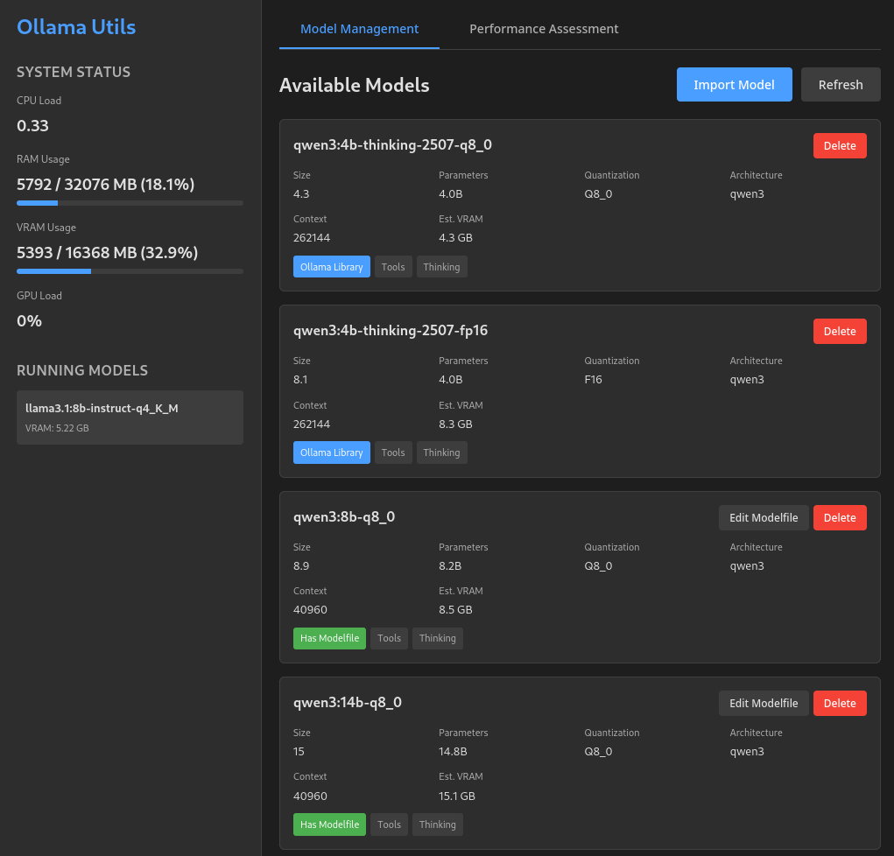

# ollama-utils



Utilities for managing Ollama LLM models, including automated installation from HuggingFace, VRAM calculator and more.
It may still be a little bit rough around the edges, but seems functional.
Most of it was optimized for my current gfx1030, can´t say if it has any issues with Nvidia cards.

## Web Interface

Start the web interface:
```bash
./start-web.sh
```

Then open http://localhost:5000

The web interface provides:

- **Model Management**: View, install, and delete Ollama models
- **Import from HuggingFace**: Download GGUF models with automatic Modelfile generation (includes capabilities support)
- **Performance Assessment**: Test VRAM usage and optimize context size
- **Real-time Monitoring**: System resources, GPU metrics, and running models

**Capabilities Support in Web UI**: When importing models from HuggingFace, the generated Modelfile includes a `# capabilities: tools` comment for documentation. This helps track which models support features like tool calling or vision. Note that capabilities are automatically detected by Ollama from the GGUF file metadata.

## Components

### HuggingFace LLM Installer (`hf-llm-install.py`)

Automatically downloads GGUF files from HuggingFace and creates Ollama models based on Modelfile configurations.

#### Features

- Downloads GGUF models directly from HuggingFace repositories
- **SHA256 checksum verification** for downloaded files
- **Disk space checking** before downloads
- **Dry run mode** to preview installations
- **Parallel processing** for faster batch installations
- **Skip existing models** to avoid reinstalling
- Automatically creates Ollama models from Modelfiles
- Supports batch processing of multiple models
- Cleans up temporary files after installation
- Progress indication during downloads

#### Usage

```bash
# Install all models from the default modelfile-repo directory
python3 scripts/hf-llm-install.py

# Install a specific model
python3 scripts/hf-llm-install.py modelfile-repo/ministral-3-8b-instruct-2512-q5_k_m.Modelfile

# Dry run to see what would be installed
python3 scripts/hf-llm-install.py --dry-run

# Skip models that already exist in Ollama
python3 scripts/hf-llm-install.py --skip-existing

# Install with 3 parallel downloads
python3 scripts/hf-llm-install.py --parallel 3

# Install all models from a custom directory
python3 scripts/hf-llm-install.py --dir /path/to/modelfiles
```

#### Modelfile Format

Each `.Modelfile` must include a special header with the HuggingFace upstream URL.

**Option 1: Specify exact GGUF file:**

```dockerfile
# ollama-utils-metadata
# hf_upstream: https://huggingface.co/org/repo/blob/main/model.gguf
# sha256: abc123... (optional - for checksum verification)
FROM ./model.gguf

# ... rest of your Modelfile configuration
```

**Option 2: Specify repo and quantization:**

```dockerfile
# ollama-utils-metadata
# hf_upstream: https://huggingface.co/mistralai/Ministral-3-3B-Instruct-2512-GGUF
# quantization: q5_k_m (optional - default: q4_k_m)
# capabilities: tools (optional - comma-separated list: tools, vision)
# sha256: abc123... (optional - for checksum verification)
FROM ./model.gguf

# ... rest of your Modelfile configuration
```

When using Option 2, the script automatically constructs the GGUF filename from the repo name and quantization level.

**Capabilities Support:**

The `capabilities` metadata field allows you to document which capabilities your model supports (like tool calling or vision). While Ollama automatically detects capabilities from the GGUF file metadata, adding this comment helps with documentation and tracking which models have which features.

Common capabilities:

- `tools` - For models that support function/tool calling (e.g., Qwen2.5, Mistral)
- `vision` - For models that support image input (multimodal models)

Example:

```dockerfile
# capabilities: tools
# capabilities: tools, vision
```

**Note:** Capabilities are read from the GGUF file's metadata by Ollama. The `# capabilities:` comment serves as documentation to track expected model features. If a model doesn't show the expected capabilities after installation, it may be due to the GGUF file lacking that metadata.

The script will:

1. Parse the `hf_upstream` URL from the Modelfile header
2. Convert blob URLs to resolve URLs for direct download
3. Download the GGUF file to a temporary location
4. Create the Ollama model (name derived from the HuggingFace repo name)
5. Clean up the temporary GGUF file

#### Installation Requirements

- Python 3.6+
- Ollama installed and available in PATH
- Internet connection for downloading models

### Other Scripts

- `context-optimizer.py` - Find optimal num_ctx for models based on VRAM constraints
- `vram-test.py` - Test models for VRAM usage and CPU offloading
- `model-info.py` - Display information about Ollama models
- `ollama-monitor.py` - Monitor Ollama service status

## Repository Structure

```text
ollama-utils/
├── web_app.py         # Web interface (Flask application)
├── requirements.txt   # Python dependencies
├── templates/         # HTML templates
│   └── index.html
├── static/            # CSS and JavaScript
│   ├── style.css
│   └── script.js
├── scripts/           # Utility scripts
│   ├── hf-llm-install.py
│   ├── context-optimizer.py
│   ├── vram-test.py
│   ├── model-info.py
│   └── ollama-monitor.py
├── modelfile-repo/    # Collection of pre-configured Modelfiles
│   └── *.Modelfile
└── README.md
```

## Requirements

- Python 3.6+
- Flask 3.0.0+
- Ollama installed and running
- AMD GPU with sysfs metrics (for GPU monitoring) or NVIDIA GPU

## License

See [LICENSE](LICENSE) file for details.
